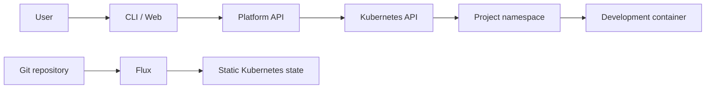

# Hestia Architecture

## Current state

Repository is at initial implementation baseline. Infrastructure playbooks and agent workflow files exist. Application and Kubernetes application resources are not implemented yet.

## System diagram

## GitOps and runtime boundary

- Flux deploys platform infrastructure and static application configuration from Git.
- Platform API creates and manages runtime project resources directly through Kubernetes.
- Runtime resources include project namespaces, RBAC, secrets, and development workloads.

## Isolation invariants

- Each project has its own namespace.
- API operations must remain within the authenticated project scope.
- Users must not access cluster administration interfaces for normal work.
- Private SSH keys never enter the platform or repository.

## Component responsibilities

- CLI and web UI are user-facing clients.
- Platform API is the control plane.
- Kubernetes stores and runs project resources.
- Development container images should contain required tools and dependencies.

## Open decisions

- Keep `app/` in this repository or move it later.
- Choose user authentication mechanism.
- Define SSH public-key onboarding.
- Choose API-to-project Kubernetes authorization mechanism.
- Define final permissions for local administrative kubeconfig.
