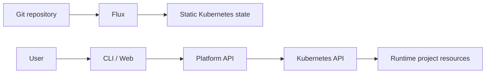
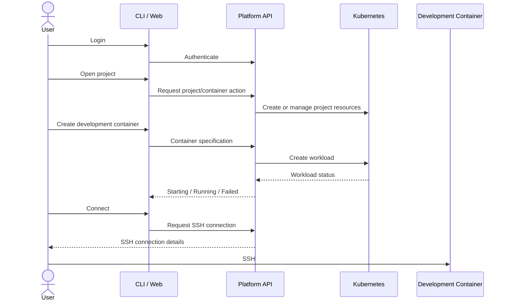
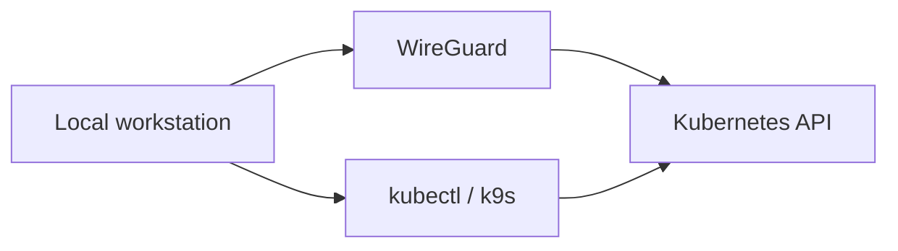

# Diploma Project Plan

## 1. Project goal

Build a self-service development-container platform on k3s.

The platform allows a user to:

1. authenticate through the CLI or web interface;
2. access their own project scope;
3. create a development container;
4. see whether the container is starting, running, or failed;
5. connect to the running container over SSH;
6. work inside the container with SSH access to the created pod

The repository also provides the GitOps state and the persistent AI project memory needed to continue development across machines, sessions, and models and the thesis itself in typst/latex. 

The project is a diploma project. Simplicity has priority. Add architecture only when a real requirement needs it.

## 2. Repository responsibilities

The repository has four main areas:

- `app/` — user-facing application source for now;
- `k3s-stack/` — Flux-managed Kubernetes configuration;
- `.agent/` — agent instructions, skills, plans, and task checklists;
- `memory/` — durable project memory, decisions, lessons, and session state;
- `thesis/` — diploma source.

Supporting scripts live under `scripts/` and suporting tools like Ansible or terraform could have their own folder. 

The user-facing application may later move to a separate repository. This is intentionally undecided. If it moves, Flux can consume the application repository as another source. Do not build a multi-repository architecture before it is needed.

## 3. Repository layout

```text
/
├── app/
│   ├── cli/
│   └── api/
│
├── k3s-stack/
│   ├── clusters/
│   │   └── home/
│   │       └── flux-system/
│   ├── infrastructure/
│   └── apps/
│
├── .agent/
│   ├── PLAN.md
│   ├── PHASE-1-TODO.md
│   ├── instructions/
│   │   ├── AGENTS_local.md
│   │   ├── AGENTS_llm.md
│   │   └── SYSTEM_PROMPT.md
│   └── skills/
│       └── PI-SKILLS.md
├── memory/
│   ├── session/
│   ├── adr/
│   ├── lesson/
│   └── architecture/
│
├── thesis/
├── scripts/
├── ansible/
├── .githooks/
└── README.md
```

There is no separate `docs/` directory.

Agent workflow files belong under `.agent/`. Durable project information
belongs under `memory/`.

## 4. GitOps boundary

Flux manages the static Kubernetes configuration under `k3s-stack/`.

The platform API manages user-generated runtime resources directly through the Kubernetes API.



Flux-managed resources include the platform infrastructure and the platform application deployment.

Runtime resources created for user projects are not committed to Git.

Typical runtime resources include:

- project ServiceAccounts;
- Roles and RoleBindings;
- secrets;

Keep the Flux structure simple.

## 5. Self-service user flow

The self-service flow is the central application feature.



The user should not need direct cluster administration access.

The user only has access to their OWN pods in their own project. 

The project namespace is the primary isolation boundary.

The API creates or manages the resources belonging to that project.

## 6. Development-container model

A project owns a Kubernetes namespace.

The platform should provide at least:

- a dedicated ServiceAccount;
- namespace-scoped permissions;
- resource limits;
- development-container workloads;

The user can specify a development container through a small declarative description, probably YAML/Json.

The description should contain only information that the platform actually needs, such as:

- image;
- resource requirements;
- connection-related settings;
- required runtime configuration.

The preferred model is that the user's image already contains all required tools and dependencies.

A general bootstrap-script should run only as a sidecart to initalize the pod with the auth keys of the user. 


## 7. SSH access

SSH has two separate concerns:

1. user identity/authentication;
2. SSH access to the running development container.

The platform must associate a user's public SSH key with that user.

The exact onboarding mechanism is still open.

One possible source is the user's public GitHub SSH keys. The project still needs to define how the user gets the key into GitHub and how the platform verifies that the key belongs to the authenticated user.

The design must answer:

- how the user authenticates;
- how the public key is registered or retrieved;
- how the key reaches the container;
- what happens if no key exists;
- what happens when the key changes;
- how invalid or unavailable keys are reported.

Private SSH keys must never be stored by the platform.

## 8. Application architecture

The application consists conceptually of:

```text
CLI / Web
    |
    v
Platform API
    |
    v
Kubernetes API
    |
    +--> Project namespace
    +--> Project RBAC
    +--> Development container
    +--> Project Jobs
```

The application should not modify GitOps manifests for normal user actions.

The API is the control plane for runtime project resources.

The CLI/web interface is the user-facing layer.

The application may be split into a separate repository later. The current plan does not depend on that decision.

## 9. RBAC and project isolation

Each project should have its own ServiceAccount and namespace-scoped authorization.

The API must prevent a project from accessing another project's resources.

The exact mechanism by which the API performs project-scoped Kubernetes operations is an implementation decision.

Possible Kubernetes-native approaches include impersonation or short-lived ServiceAccount credentials. Choose the simpler approach that satisfies the security requirements.

Do not design a larger authorization system before the MVP requires it.

## 10. AI memory

The repository must allow the project to continue across:

- different Pi sessions;
- different development machines;
- the local Qwen model;
- API/Copilot models.

The AI memory must allow an agent to determine:

- the project goal;
- the current architecture;
- the current project state;
- important decisions;
- known problems;
- relevant Git-managed resources;
- recent session state.

The durable AI-assisted project state is stored in `memory/`.

Memory types:

- `sessions/` — recent session state;
- `architecture/` — current architecture state;
- `adr/` — durable architecture decisions;
- `lessons/` — reusable lessons.

There is no separate documentation directory.

## 11. Pi agents

Every agent runs through the Pi harness.

There are two agent instruction files:

- `.agent/instructions/AGENTS_local.md` — local Qwen 7B-class model;
- `.agent/instructions/AGENTS_llm.md` — normal API/Copilot models.

The API agent must support switching between available models without changing the project memory workflow.

The intended model pool includes models such as:

- Claude Haiku 4.5 via GitHub Copilot;
- GPT-4.1 via GitHub Copilot;
- Kimi K2.7-code via GitHub Copilot;
- Kimi K3 via GitHub Copilot;
- GPT-5-mini via GitHub Copilot;
- GPT-5.4-mini via GitHub Copilot;
- GPT-5.6-Luna via GitHub Copilot.

No single model is the permanent default.

The agent instructions must remain portable across these models.

## 12. AI language and response style

All persistent project information is written in English.

Pi agents always answer in English, even when the user writes in Hungarian or another language.

Responses should be concise and information-dense.

Use a caveman-style / ASD-STE100-inspired discipline:

- short sentences;
- simple words;
- one idea per sentence;
- direct instructions;
- no unnecessary introduction;
- no repeated conclusion;
- no marketing language;
- no unnecessary hedging.

Prefer Mermaid, UML, and ASCII diagrams when they communicate the idea better than prose.

## 13. Path-scoped system prompt

`.agent/instructions/SYSTEM_PROMPT.md` defines path-scoped work.

Examples:

```text
/thesis
    -> write only thesis/
/app
    -> write only app/
/k3s-stack
    -> write only k3s-stack/
/memory
    -> write only memory/
```

The agent should load only context relevant to the active scope.

For example, a `/thesis` task should not load the entire Kubernetes configuration.

If a task requires multiple scopes, the agent must identify the cross-scope change before editing. And ask for permission to cross read from the other scope

The system prompt is a safety boundary. The Git hook is an additional repository-level boundary.

## 14. Context compaction

Context compaction is required for the local Qwen agent and can also reduce token use for API models.

When a session becomes too large, the agent should preserve current state in
the session note before continuing.

The compacted state should contain only:

- objective;
- current state;
- completed work;
- decisions;
- failures;
- next actions;
- relevant paths.

Do not preserve conversational filler.

## 15. Pi skill set

`.agent/skills/PI-SKILLS.md` defines the small Pi skill/extension set.

The skills are partly automatic and partly deliberately invoked by the user.

Initial skills:

- scope guard;
- context loader;
- context compaction;
- concise response style;
- Git/domain check;
- project-state inspection.

Keep the skill set small.

Add a new skill only when a repeated workflow justifies it.

## 16. Multi-machine Git workflow

The repository must work from multiple development machines.

The Git hook source is versioned under `.githooks/`.

After cloning on a new machine, the local hook configuration must be installed. 

The pre-commit check must detect when staged changes span multiple project domains or wrong domain.

For example:

```text
thesis/... + app/...
```

must be rejected.

The user then stages and commits the domains separately.

Commit prefixes:

- `app:`
- `infra:`
- `memory:`
- `thesis:`

The `infra:` prefix maps to `k3s-stack/`.

The hook must not depend on a specific machine, username, absolute path, or development environment.

## 17. Portability

The repository should be portable from machine A to machine B.

Target workflow:

```text
Machine B
    |
    +-- git clone
    |
    +-- install Git hooks
    |
    +-- establish WireGuard access
    |
    +-- deploy secrets
    |
    +-- obtain kubeconfig
    |
    +-- use kubectl / k9s locally
```

The repository must not contain raw secrets or machine-specific credentials.

The scripts must make the required setup repeatable.

The target assumption is that k3s is already running on the target cluster.

## 18. Secrets and runtime backup

All project secrets are kept in KeePass.

The repository must provide separate workflows for:

- backing up required runtime secrets to KeePass;
- deploying secrets from KeePass to a fresh cluster;
- backing up runtime resources that are intentionally outside GitOps;
- restoring those runtime resources.

The backup must not blindly dump the entire cluster.

Runtime backup data must not be committed to Git.

The exact KeePass entry structure is an implementation detail and should be kept simple.

## 19. Local kubectl and k9s

The developer is the preson who develops the platform, commits to the git repo. Not the user who creates containers and jobs.
The developer reaches the cluster through WireGuard.

The user should not need to SSH into the k3s machine for normal Kubernetes work.

A local kubeconfig is therefore required.



The repository must provide a kubeconfig export workflow that:

- obtains the cluster kubeconfig;
- replaces the local-only Kubernetes API endpoint with the WireGuard-reachable endpoint;
- produces a local kubeconfig;
- allows both `kubectl` and `k9s` to work without SSHing into the cluster host.

The kubeconfig contains credentials and must never be committed.

A restricted administrative kubeconfig can replace the initial admin kubeconfig later if needed.

## 20. Infrastructure scope

The initial infrastructure is intentionally small.

It consists of:

- Proxmox;
- k3s;
- storage required by the platform;
- a local registry if required;
- Flux;
- platform API;
- CLI/web interface;
- development-container workflow.

Do not add advanced monitoring, SSO, custom operators, GPU support, complex networking, or multi-environment structures unless the actual project requires them.

## 21. Bootstrap and operational scripts

The repository should contain scripts for:

- installing local Git hooks;
- deploying secrets;
- backing up secrets;
- exporting kubeconfig;
- resetting the environment when required.

These scripts are operational tooling, not GitOps resources.

## 22. Implementation order

A practical order is:

1. Define the repository and AI workflow.
2. Establish the k3s + Flux base.
3. Deploy the platform API.
4. Implement project isolation and RBAC.
5. Implement development-container creation and status.
6. Implement SSH access.
7. Implement the CLI/web user flow.
8. Implement secret and runtime backup/restore.
9. Implement local kubeconfig export and k9s access.
10. Evaluate the complete system.
11. Document the result in the thesis.

Change the order if implementation reveals a real dependency.

## 23. Open decisions

Keep only decisions that are actually unresolved:

- whether `app/` remains in this repository or moves to a separate repository;
- the exact user authentication mechanism;
- the SSH public-key onboarding flow;
- the exact API-to-project Kubernetes authorization mechanism;
- the final permissions for the local administrative kubeconfig;
- the exact Pi skill loading mechanism.

Do not add speculative architecture to resolve these decisions early.
