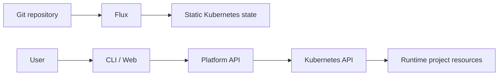
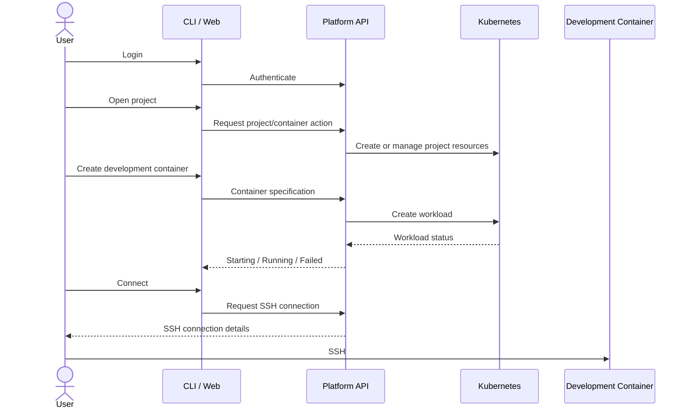

# Diploma Project Plan

## 1. Project goal

Build a self-service development-container platform on k3s.

The platform allows a user to:

1. authenticate through the CLI or web interface;
2. access their own project scope;
3. create a development container;
4. see whether the container is starting, running, or failed;
5. connect to the running container over SSH;
6. work inside the container with SSH access to the created pod

The repository also provides the GitOps state and the persistent AI project memory needed to continue development across machines, sessions, and models and the thesis itself in typst/latex. 

The project is a diploma project. Simplicity has priority. Add architecture only when a real requirement needs it.

## 2. Repository responsibilities

The repository has four main areas:

- `.agent/` — agent instructions, skills, plans, and memory;
- `app/` — user-facing application source for now;
- `k3s-stack/` — Flux-managed Kubernetes configuration;
- `thesis/` — diploma typst source.

Supporting scripts live under `scripts/` and suporting tools like Ansible or terraform could have their own folder. 

The user-facing application may later move to a separate repository. This is intentionally undecided. If it moves, Flux can consume the application repository as another source. Do not build a multi-repository architecture before it is needed.

## 3. Repository layout

```text
/
├── app/
│   ├── cli/
│   └── api/
│
├── k3s-stack/
│   ├── services/
│   ├── clusters/
│       └── flux-system/
│   ├── infra/
│   └── apps/
│
├── .agent/
│   ├── PLAN.md
│   ├── SYSTEM_PROMPT.md
│   ├── sessions/
    └── skills/
├── thesis/
├── scripts/
├── ansible/
├── .githooks/
└── README.md
```

There is no separate `docs/` directory.

## 4. GitOps boundary

Flux manages the static Kubernetes configuration under `k3s-stack/`.
The platform API manages user-generated runtime resources directly through the Kubernetes API.



Flux-managed resources include the platform infrastructure and the platform application deployment.

Runtime resources created for user projects are not committed to Git. 
Typical runtime resources include:
- project ServiceAccounts;
- Roles and RoleBindings;
- secrets;

## 5. Self-service user flow

The self-service flow is the central application feature.



The user should not need direct cluster administration access. All communcation to the cluster goes through the CLI/API. 
The user has access to all the pods in their project. 
The project namespace is the primary isolation boundary.
The API creates or manages the resources belonging to that project.

## 6. Development-container model

A project owns a Kubernetes namespace. Declared in the project directory and the project resource. 

The project should provide at least:
- a dedicated ServiceAccount;
- namespace-scoped permissions;
- resource limits;
- development-container workloads;

The user can specify a development container through a small declarative description, probably YAML/Json.
The description should contain only information that the platform actually needs, such as:
- image;
- resource requirements;
- connection-related settings;
- required runtime configuration.

The preferred model is that the user's image already contains all required tools and dependencies.
A general bootstrap-script should run only as a sidecart to initalize the pod with the auth keys of the user. 

## 7. SSH access
SSH has two separate concerns:
1. user identity/authentication;
2. SSH access to the running development container.

The platform must associate a user's public SSH key with that user.
The exact onboarding mechanism is still open.

One possible source is the user's public GitHub SSH keys. The project still needs to define how the user gets the key into GitHub and how the platform verifies that the key belongs to the authenticated user.

The design must answer:
- how the user authenticates;
- how the public key is registered or retrieved;
- how the key reaches the container;
- what happens if no key exists;
- what happens when the key changes;
- how invalid or unavailable keys are reported.

Private SSH keys must never be stored by the platform.

## 8. Application architecture

The application consists conceptually of:

```text
CLI / Web
    |
    v
Platform API
    |
    v
Kubernetes API
    |
    +--> Project namespace
    +--> Project RBAC
    +--> Development container
    +--> Project Jobs
```

The application should not modify GitOps manifests for normal user actions.
The API is the control plane for runtime project resources.
The CLI/web interface is the user-facing layer.
The application may be split into a separate repository later. The current plan does not depend on that decision.

## 9. RBAC and project isolation
Each project should have its own ServiceAccount and namespace-scoped authorization.
The API must prevent a project from accessing another project's resources.
The exact mechanism by which the API performs project-scoped Kubernetes operations is an implementation decision.
Possible Kubernetes-native approaches include impersonation or short-lived ServiceAccount credentials. Choose the simpler approach that satisfies the security requirements.

## 18. Secrets and runtime backup

All project secrets are kept in KeePass.
The repository must provide separate workflows for:
- backing up required runtime secrets to KeePass;
- deploying secrets from KeePass to a fresh cluster;
- backing up runtime resources that are intentionally outside GitOps;
- restoring those runtime resources.

The backup must not blindly dump the entire cluster.
Runtime backup data must not be committed to Git.
The exact KeePass entry structure is an implementation detail and should be kept simple.

## 23. Open decisions

Keep only decisions that are actually unresolved:
- whether `app/` remains in this repository or moves to a separate repository;
- the exact user authentication mechanism;
- the SSH public-key onboarding flow;
- the exact API-to-project Kubernetes authorization mechanism;
- the final permissions for the local administrative kubeconfig;
